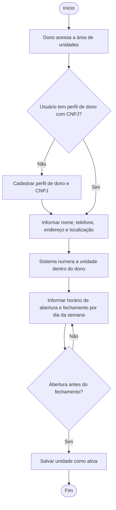
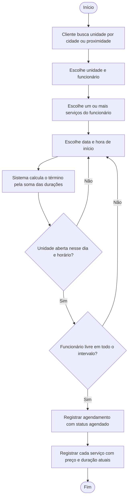
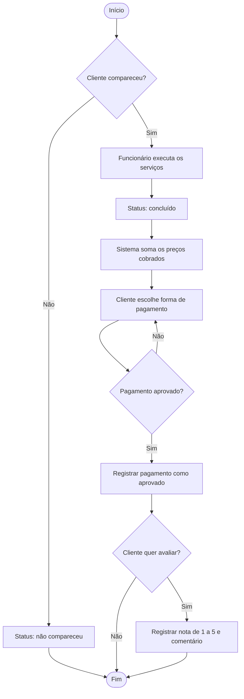
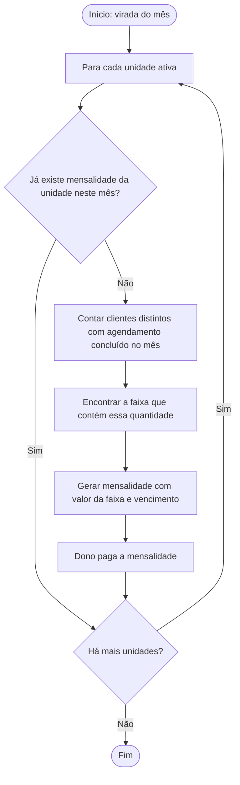
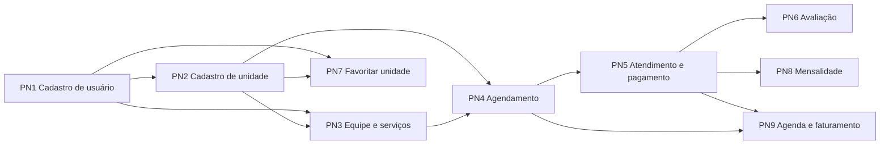
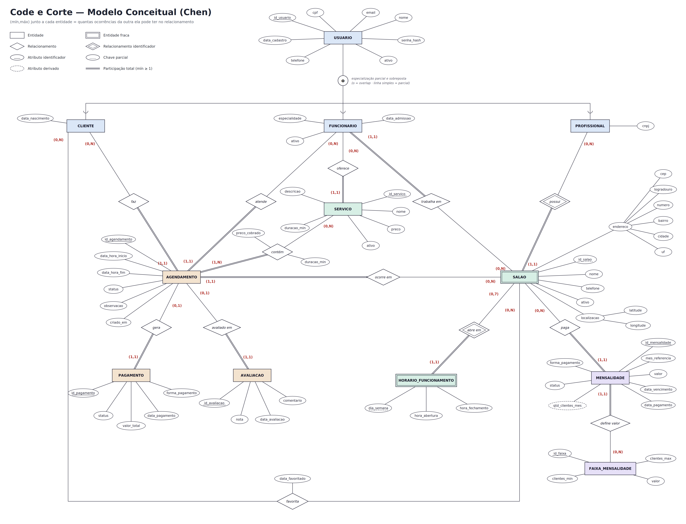
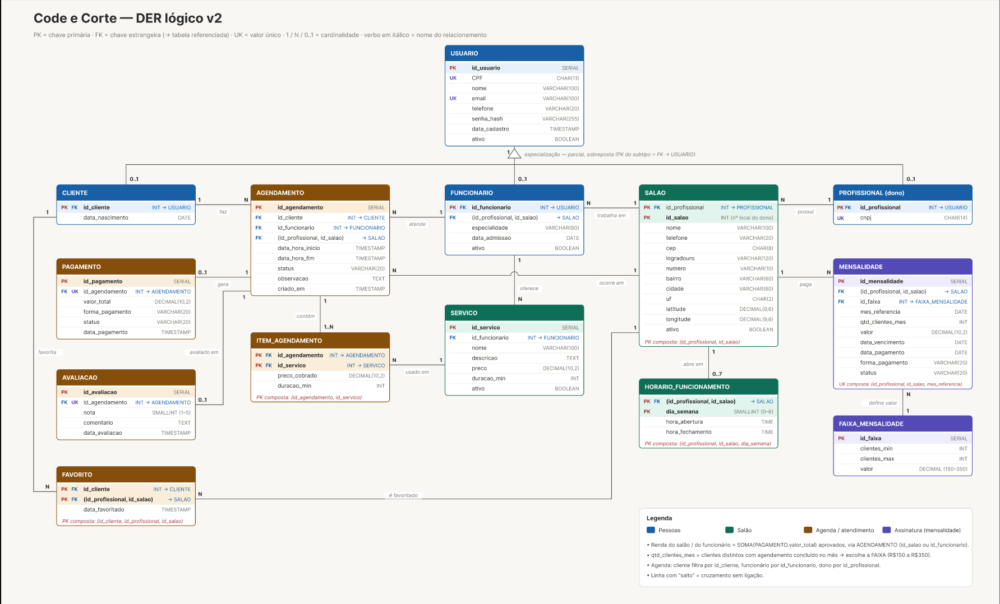

# Projeto ERP — Code e Corte

> Primeira entrega do Projeto Integrador de Modelagem de Dados: do problema real ao Modelo Conceitual de Dados.

**Sumário**

1. [Identificação da equipe](#1-identificação-da-equipe)
2. [Caracterização da empresa](#2-caracterização-da-empresa)
3. [Justificativa da escolha](#3-justificativa-da-escolha)
4. [Problemas identificados](#4-problemas-identificados)
5. [Processos de negócio](#5-processos-de-negócio)
6. [Requisitos funcionais](#6-requisitos-funcionais)
7. [Requisitos não funcionais](#7-requisitos-não-funcionais)
8. [Regras de negócio](#8-regras-de-negócio)
9. [Restrições e políticas organizacionais](#9-restrições-e-políticas-organizacionais)
10. [Fluxogramas](#10-fluxogramas)
11. [Entidades](#11-entidades)
12. [Atributos](#12-atributos)
13. [Relacionamentos](#13-relacionamentos)
14. [Cardinalidades](#14-cardinalidades)
15. [Dicionário de dados conceitual](#15-dicionário-de-dados-conceitual)
16. [DER](#16-der)
17. [Justificativas técnicas](#17-justificativas-técnicas)
18. [Conclusão](#18-conclusão)

---

## 1. Identificação da equipe

| Integrante | RA | Papel na entrega |
|---|---|---|
| _Ismael Aparecido da Silva_ | _47347899_ | _[ex.: levantamento de requisitos]_ |
| _Israel Aparecido da Silva_ | _[RA]_ | _[ex.: fluxogramas]_ |
| _Renan da Silva Queiroz_ | _[RA]_ | _[ex.: DER e dicionário de dados]_ |
| _Matheus Pereira de Carvalho Santos_ | _[RA]_ | _[ex.: revisão e justificativas]_ |
| _Diego Blanco Simara Estorce_ | _[RA]_ | _[ex.: revisão e justificativas]_ |
| _juliana de sousa nascimento_ | _[RA]_ | _[ex.: revisão e justificativas]_ |
| _Lucas Henrique Ribeiro Lima_ | _[RA]_ | _[ex.: revisão e justificativas]_ |
| _Henry de Araujo Fernandes_ | _[RA]_ | _[ex.: revisão e justificativas]_ |
| _yuri silvério gomes_ | _[RA]_ | _[ex.: revisão e justificativas]_ |

**Startup:** Code e Corte
**Disciplina:** Projeto Integrador — Modelagem de Dados
**Professor(a):** _[nome]_

---

## 2. Caracterização da empresa

| Item | Descrição |
|---|---|
| **Nome** | Code e Corte (plataforma) atendendo salões de beleza e barbearias de pequeno porte |
| **Segmento** | Serviços de beleza e estética: corte, barba, coloração, manicure e tratamentos |
| **O que oferece** | Serviços executados por profissionais do salão, com duração e preço definidos por profissional |
| **Principais clientes** | Pessoas físicas da região do salão, que agendam por telefone, WhatsApp ou chegando no balcão |
| **Setores** | Atendimento/recepção (agenda), equipe de profissionais (execução dos serviços), caixa (recebimento) e gestão do dono (financeiro, equipe e horários) |

**Como funciona hoje.** O cliente entra em contato com o salão por WhatsApp, telefone ou pessoalmente e pede um horário. Quem atende consulta uma agenda em papel ou em uma planilha compartilhada e anota o nome do cliente, o serviço e o profissional. No dia, o profissional executa o serviço, o cliente paga no caixa (dinheiro, Pix ou cartão) e o valor é anotado em um caderno ou planilha separada. No fim do mês, o dono soma manualmente o que cada profissional produziu para calcular comissões e o faturamento de cada unidade.

Muitos donos têm mais de uma unidade (por exemplo, um salão no centro e outro no bairro), cada uma com sua equipe, seu horário de funcionamento e sua própria lista de serviços. Não existe um cadastro único de clientes: o mesmo cliente aparece com nomes e telefones diferentes em cada unidade, e o histórico de serviços, preços cobrados e opinião do cliente se perde.

**Informações importantes para o negócio:**

- quem é o cliente e como contatá-lo;
- quais profissionais trabalham em cada unidade e quais serviços cada um faz, com preço e duração;
- a agenda de cada profissional, com horário de início e fim de cada atendimento;
- quanto foi cobrado em cada atendimento e como foi pago;
- o horário de funcionamento de cada unidade em cada dia da semana;
- a opinião do cliente sobre o atendimento;
- quanto cada unidade e cada profissional faturou no período.

A Code e Corte entra como a startup que organiza essas informações em um sistema único. O modelo de cobrança da plataforma é uma mensalidade por unidade, calculada pela quantidade de clientes atendidos no mês, o que também passa a fazer parte dos dados do sistema.

---

## 3. Justificativa da escolha

Escolhemos salões e barbearias porque o negócio reúne, em escala pequena, todos os elementos que a modelagem de dados precisa tratar:

- **Processos que podem ser analisados.** O ciclo agendar → atender → receber → avaliar se repete dezenas de vezes por dia e tem início, decisões e fim bem definidos.
- **Problemas reais de organização da informação.** Agenda em papel, preços que mudam sem registro, cadastro de clientes duplicado entre unidades e faturamento somado à mão (detalhados na seção 4).
- **Necessidade de integração.** A agenda depende do horário de funcionamento da unidade, dos serviços do profissional e da duração de cada serviço; o financeiro depende da agenda; a cobrança da plataforma depende do número de clientes atendidos. Hoje cada uma dessas informações está em um lugar diferente.
- **Aplicação de um ERP.** O sistema integra cadastro (clientes, equipe, serviços), operação (agenda e atendimento), financeiro (pagamentos e faturamento) e relacionamento com o cliente (avaliações e favoritos), que são módulos típicos de um ERP para empresa de serviços.

Além disso, o negócio tem situações de modelagem que vão além do básico: um mesmo usuário pode ser cliente e funcionário ao mesmo tempo (especialização sobreposta), um agendamento pode ter vários serviços (relacionamento N:N com atributos) e uma unidade só é identificada junto com o seu dono (entidade fraca). Isso torna o caso adequado para exercitar e justificar decisões de modelagem.

---

## 4. Problemas identificados

| # | Problema | Consequência |
|---|---|---|
| P1 | Agenda em papel ou planilha, sem verificar a duração do serviço | Dois clientes marcados no mesmo horário com o mesmo profissional; atrasos em cadeia |
| P2 | Agendamentos fora do horário da unidade não são bloqueados | Cliente marcado em dia ou hora em que o salão está fechado |
| P3 | Cadastro de clientes separado por unidade e por profissional | Clientes duplicados, telefones desatualizados, histórico perdido |
| P4 | Preço do serviço muda e o valor cobrado não fica registrado | Impossível saber quanto foi cobrado em atendimentos antigos; divergência no caixa |
| P5 | Pagamentos anotados em caderno separado da agenda | Atendimento realizado sem pagamento registrado; difícil conferir o caixa |
| P6 | Faturamento por profissional e por unidade calculado à mão | Erros no cálculo de comissões e demora no fechamento do mês |
| P7 | Opinião do cliente fica só no boca a boca ou em redes sociais | O dono não sabe quais profissionais ou serviços geram reclamação |
| P8 | Cliente não encontra facilmente salões próximos nem guarda os que gostou | Perda de clientes novos e de retorno |
| P9 | Vários donos e várias unidades com os mesmos tipos de controle | Cada unidade reinventa a própria planilha; nada é comparável |
| P10 | Cobrança da plataforma sem base clara de cálculo | Disputa sobre o valor da mensalidade |

**Necessidades levantadas a partir dos problemas:**

- N1 — agenda única por profissional, que respeite duração dos serviços e horário da unidade (P1, P2);
- N2 — cadastro único de pessoas, válido para qualquer unidade (P3);
- N3 — registro do preço praticado em cada atendimento (P4);
- N4 — pagamento vinculado ao atendimento (P5);
- N5 — relatórios de faturamento por profissional e por unidade (P6);
- N6 — avaliação do atendimento pelo cliente (P7);
- N7 — busca de salões por localização e lista de favoritos (P8);
- N8 — estrutura que suporte vários donos e várias unidades por dono (P9);
- N9 — mensalidade calculada por faixa de clientes atendidos (P10).

---

## 5. Processos de negócio

| # | Processo | Quem participa | O que inicia | O que acontece | Informação gerada | Resultado |
|---|---|---|---|---|---|---|
| PN1 | Cadastro de usuário | Visitante | Primeiro acesso | Informa dados pessoais, cria senha e escolhe perfil(is): cliente, funcionário e/ou dono | USUARIO e perfis (CLIENTE, FUNCIONARIO, PROFISSIONAL) | Pessoa identificada no sistema |
| PN2 | Cadastro de unidade (salão) | Dono | Dono quer abrir uma unidade na plataforma | Informa nome, contato, endereço, localização e horários por dia da semana | SALAO, HORARIO_FUNCIONAMENTO | Unidade apta a receber agendamentos |
| PN3 | Montagem da equipe e do catálogo | Dono, funcionário | Contratação de profissional | Funcionário é vinculado a uma unidade e cadastra os serviços que executa, com preço e duração | FUNCIONARIO (vínculo), SERVICO | Agenda do profissional disponível |
| PN4 | Agendamento | Cliente, funcionário | Cliente quer um horário | Cliente escolhe unidade, profissional, um ou mais serviços e horário; sistema calcula o fim e verifica conflitos | AGENDAMENTO, itens do agendamento | Horário reservado |
| PN5 | Atendimento e pagamento | Funcionário, cliente, caixa | Chegada do cliente no horário | Serviço é executado, agendamento é concluído e o pagamento é registrado | Status do AGENDAMENTO, PAGAMENTO | Atendimento quitado |
| PN6 | Avaliação | Cliente | Atendimento concluído | Cliente dá nota de 1 a 5 e comentário opcional | AVALIACAO | Retorno de qualidade para o dono |
| PN7 | Favoritar unidade | Cliente | Cliente gostou de uma unidade | Unidade é guardada na lista do cliente | Vínculo de favorito com data | Acesso rápido para reagendar |
| PN8 | Cobrança da mensalidade | Plataforma, dono | Virada do mês | Sistema conta clientes distintos atendidos na unidade, encontra a faixa e gera a mensalidade; dono paga | MENSALIDADE | Unidade em dia com a plataforma |
| PN9 | Consulta de agenda e faturamento | Cliente, funcionário, dono | Consulta | Cada perfil vê a sua agenda; dono vê faturamento por unidade e por profissional | Relatórios (derivados) | Acompanhamento do negócio |

**Integração entre processos.** PN1 alimenta todos os outros. PN2 e PN3 são pré-requisitos de PN4. PN4 gera o agendamento que PN5 conclui e paga, e que PN6 avalia. PN5 alimenta PN8 (clientes atendidos no mês) e PN9 (faturamento). O diagrama da seção 10.5 mostra essa cadeia.

---

## 6. Requisitos funcionais

| ID | Requisito | Atende |
|---|---|---|
| RF01 | O sistema deverá cadastrar usuários com nome, CPF, e-mail, telefone e senha. | N2 |
| RF02 | O sistema deverá permitir que um mesmo usuário tenha os perfis de cliente, funcionário e dono, isolados ou combinados. | N2, N8 |
| RF03 | O sistema deverá cadastrar unidades (salões) vinculadas a um dono, com endereço e coordenadas de localização. | N8 |
| RF04 | O sistema deverá cadastrar o horário de abertura e fechamento de cada unidade por dia da semana. | N1 |
| RF05 | O sistema deverá vincular funcionários a uma unidade, com especialidade e data de admissão. | N8 |
| RF06 | O sistema deverá permitir que cada funcionário cadastre os serviços que executa, com preço e duração. | N1, N3 |
| RF07 | O sistema deverá registrar agendamentos com cliente, funcionário, unidade, data e hora de início. | N1 |
| RF08 | O sistema deverá permitir incluir um ou mais serviços em um mesmo agendamento. | N1 |
| RF09 | O sistema deverá calcular a hora de término do agendamento pela soma das durações dos serviços escolhidos. | N1 |
| RF10 | O sistema deverá impedir agendamentos fora do horário de funcionamento da unidade ou em conflito com outro agendamento do mesmo funcionário. | N1 |
| RF11 | O sistema deverá registrar, em cada serviço do agendamento, o preço cobrado e a duração no momento da marcação. | N3 |
| RF12 | O sistema deverá permitir alterar o status do agendamento (agendado, confirmado, concluído, cancelado, não compareceu). | N1, N4 |
| RF13 | O sistema deverá registrar o pagamento de um agendamento, com valor total, forma de pagamento e status. | N4 |
| RF14 | O sistema deverá permitir que o cliente avalie um agendamento concluído com nota de 1 a 5 e comentário. | N6 |
| RF15 | O sistema deverá permitir que o cliente favorite e desfavorite unidades. | N7 |
| RF16 | O sistema deverá permitir buscar unidades por cidade, bairro e proximidade. | N7 |
| RF17 | O sistema deverá exibir a agenda filtrada por perfil: o cliente vê os próprios agendamentos, o funcionário vê os que atende e o dono vê os de suas unidades. | N1 |
| RF18 | O sistema deverá apresentar o faturamento por unidade e por funcionário em um período, somando pagamentos aprovados. | N5 |
| RF19 | O sistema deverá gerar mensalmente a mensalidade de cada unidade a partir da faixa de clientes atendidos. | N9 |
| RF20 | O sistema deverá registrar o pagamento da mensalidade pelo dono. | N9 |
| RF21 | O sistema deverá permitir desativar usuários, unidades, funcionários e serviços sem apagar o histórico. | N3, N5 |

---

## 7. Requisitos não funcionais

| ID | Categoria | Requisito |
|---|---|---|
| RNF01 | Segurança | O sistema deverá armazenar senhas apenas como hash, nunca em texto aberto. |
| RNF02 | Controle de acesso | O sistema deverá controlar o acesso por perfil: dados financeiros de uma unidade só são visíveis ao seu dono. |
| RNF03 | Privacidade | O sistema deverá tratar CPF, telefone e e-mail conforme a LGPD, exibindo-os apenas a quem precisa deles para o atendimento. |
| RNF04 | Integridade | O sistema deverá garantir que nenhum agendamento, pagamento ou avaliação fique sem o registro ao qual pertence (integridade referencial). |
| RNF05 | Desempenho | A consulta de horários livres de um profissional deverá responder em até 2 segundos em uso normal. |
| RNF06 | Disponibilidade | O sistema deverá estar disponível 24 horas, já que o cliente agenda fora do horário do salão. |
| RNF07 | Usabilidade | A interface deverá funcionar em celular, tablet e computador, pois a maior parte dos agendamentos é feita pelo celular. |
| RNF08 | Rastreabilidade | O sistema deverá registrar data e hora de cadastro de usuários e de criação de agendamentos. |
| RNF09 | Escalabilidade | O modelo deverá suportar vários donos, várias unidades por dono e várias equipes sem alteração de estrutura. |
| RNF10 | Confiabilidade | Valores monetários deverão ser registrados com duas casas decimais, sem arredondamentos acumulados. |

---

## 8. Regras de negócio

| ID | Regra | Onde aparece no modelo |
|---|---|---|
| RN01 | CPF e e-mail não podem se repetir entre usuários. | USUARIO.cpf e USUARIO.email únicos |
| RN02 | Um usuário pode ser cliente, funcionário e dono ao mesmo tempo, ou ainda não ter perfil (cadastro incompleto). | Especialização parcial e sobreposta |
| RN03 | Todo dono deve informar um CNPJ, que não pode se repetir. | PROFISSIONAL.cnpj único |
| RN04 | Um dono pode ter várias unidades; toda unidade pertence a exatamente um dono. | PROFISSIONAL (0,N) — possui — SALAO (1,1) |
| RN05 | As unidades são numeradas por dono (unidade 1, 2, 3 do mesmo dono). | SALAO como entidade fraca, chave parcial id_salao |
| RN06 | Um funcionário trabalha em exatamente uma unidade; uma unidade pode ter vários funcionários ou nenhum (recém-aberta). | FUNCIONARIO (1,1) — trabalha em — SALAO (0,N) |
| RN07 | Cada serviço pertence a um único funcionário, que define preço e duração; um funcionário pode oferecer vários serviços. | FUNCIONARIO (0,N) — oferece — SERVICO (1,1) |
| RN08 | Todo agendamento é de um único cliente, com um único funcionário, em uma única unidade. | AGENDAMENTO (1,1) em faz, atende e ocorre em |
| RN09 | Um agendamento deve conter pelo menos um serviço e pode conter vários; um serviço pode estar em vários agendamentos. | AGENDAMENTO (1,N) — contém — SERVICO (0,N) |
| RN10 | O mesmo serviço não se repete dentro de um agendamento. | Identificação do item por (agendamento, serviço) |
| RN11 | O preço e a duração usados no agendamento são os do momento da marcação; mudanças futuras no serviço não alteram agendamentos já feitos. | Atributos preco_cobrado e duracao_min em "contém" |
| RN12 | Os serviços de um agendamento devem ser do funcionário do agendamento, e esse funcionário deve trabalhar na unidade do agendamento. | Restrição entre atende, oferece, trabalha em e ocorre em |
| RN13 | A hora de término do agendamento é a hora de início mais a soma das durações dos serviços. | data_hora_fim calculado a partir de "contém" |
| RN14 | Um agendamento só pode ser marcado em dia e horário em que a unidade está aberta. | HORARIO_FUNCIONAMENTO |
| RN15 | Um funcionário não pode ter dois agendamentos ativos (não cancelados) com horários sobrepostos. | Verificação em AGENDAMENTO |
| RN16 | Cada unidade tem no máximo um horário por dia da semana (0 = domingo a 6 = sábado); dia sem horário cadastrado é dia fechado. A abertura deve ser anterior ao fechamento. | SALAO (0,7) — abre em — HORARIO_FUNCIONAMENTO (1,1) |
| RN17 | Um agendamento tem no máximo um pagamento, e só pode ser pago depois de concluído. | AGENDAMENTO (0,1) — gera — PAGAMENTO (1,1) |
| RN18 | O valor total do pagamento é a soma dos preços cobrados nos serviços do agendamento. | PAGAMENTO.valor_total |
| RN19 | Um agendamento recebe no máximo uma avaliação, feita pelo próprio cliente e somente após a conclusão; a nota vai de 1 a 5. | AGENDAMENTO (0,1) — avaliado em — AVALIACAO (1,1) |
| RN20 | Um cliente favorita uma mesma unidade no máximo uma vez. | Relacionamento N:N "favorita" |
| RN21 | Cada unidade tem no máximo uma mensalidade por mês de referência. | MENSALIDADE: (unidade, mes_referencia) único |
| RN22 | A quantidade de clientes do mês é o número de clientes distintos com agendamento concluído na unidade naquele mês; ela define a faixa da mensalidade. | qtd_clientes_mes (derivado) |
| RN23 | As faixas de mensalidade não se sobrepõem e têm valor entre R$ 150,00 e R$ 350,00. O valor é copiado para a mensalidade no momento da geração. | FAIXA_MENSALIDADE, MENSALIDADE.valor |
| RN24 | O faturamento de uma unidade ou de um funcionário considera apenas pagamentos aprovados. | PAGAMENTO.status |
| RN25 | Registros com histórico (usuários, unidades, funcionários, serviços) não são apagados; são desativados. | Atributo ativo |

---

## 9. Restrições e políticas organizacionais

| ID | Política | Motivo |
|---|---|---|
| PO01 | Só o dono pode cadastrar, editar ou desativar suas unidades e os horários de funcionamento. | A unidade é responsabilidade legal do dono (CNPJ). |
| PO02 | Só o dono da unidade vincula ou desliga funcionários dela. | Evita que alguém se declare funcionário de uma unidade sem autorização. |
| PO03 | O funcionário define preço e duração dos próprios serviços; o dono pode editá-los nas suas unidades. | Profissionais da mesma unidade cobram valores diferentes pelo mesmo tipo de serviço. |
| PO04 | Cancelamento pelo cliente deve ser feito com antecedência mínima de _[X]_ horas; depois disso o status vira "não compareceu". | Proteger a agenda do profissional. _(Prazo a definir com o salão.)_ |
| PO05 | Formas de pagamento aceitas: dinheiro, Pix, cartão de débito e cartão de crédito. | Formas usadas hoje no caixa. |
| PO06 | Avaliações não podem ser editadas pelo dono nem pelo funcionário. | Garantir que a avaliação represente a opinião do cliente. |
| PO07 | A mensalidade vence no dia _[X]_ do mês seguinte ao de referência. Unidade com mensalidade em atraso por mais de _[X]_ dias pode ser desativada para novos agendamentos. | Sustentabilidade da plataforma. _(Prazos a definir.)_ |
| PO08 | Os relatórios de faturamento de uma unidade são restritos ao seu dono; o funcionário vê apenas o próprio faturamento. | Sigilo financeiro. |
| PO09 | Dados pessoais de clientes só são exibidos ao funcionário e ao dono da unidade em que o cliente tem agendamento. | LGPD (ligada ao RNF03). |

---

## 10. Fluxogramas

Os fluxogramas usam Mermaid e são exibidos diretamente pelo GitHub.

### 10.1 PN2 — Cadastro de unidade

### 10.2 PN4 — Agendamento

### 10.3 PN5 e PN6 — Atendimento, pagamento e avaliação

### 10.4 PN8 — Cobrança da mensalidade

### 10.5 Integração entre os processos

---

## 11. Entidades

| Entidade | Por que existe | Origem |
|---|---|---|
| **USUARIO** | Cadastro único de qualquer pessoa que usa o sistema, para evitar duplicidade entre unidades. | P3, RF01, RN01 |
| **CLIENTE** | Perfil de quem agenda serviços; especialização de USUARIO. | RF02, RF07 |
| **FUNCIONARIO** | Perfil de quem executa serviços em uma unidade; especialização de USUARIO. | RF05, RN06 |
| **PROFISSIONAL** (dono) | Perfil de quem é dono de unidades e paga a plataforma; especialização de USUARIO. | RF03, RN03 |
| **SALAO** | Cada unidade física, com endereço, contato e localização. Entidade fraca de PROFISSIONAL. | RF03, RN04, RN05 |
| **HORARIO_FUNCIONAMENTO** | Horário de cada unidade em cada dia da semana. Entidade fraca de SALAO. | P2, RF04, RN16 |
| **SERVICO** | O que o funcionário oferece, com preço e duração próprios. | RF06, RN07 |
| **AGENDAMENTO** | A reserva de um horário: une cliente, funcionário e unidade. | P1, RF07, RN08 |
| **PAGAMENTO** | O recebimento de um agendamento concluído. | P5, RF13, RN17 |
| **AVALIACAO** | A opinião do cliente sobre um atendimento. | P7, RF14, RN19 |
| **MENSALIDADE** | A cobrança mensal da plataforma para cada unidade. | P10, RF19 |
| **FAIXA_MENSALIDADE** | Tabela de faixas de clientes e valores da mensalidade. | P10, RN23 |

**Substantivos que não viraram entidade:**

- *Item do agendamento* virou o relacionamento **contém** entre AGENDAMENTO e SERVICO, com atributos próprios (seção 13).
- *Favorito* virou o relacionamento **favorita** entre CLIENTE e SALAO, com a data em que foi favoritado.
- *Endereço* e *localização* viraram atributos compostos de SALAO, porque não são compartilhados entre unidades.
- *Faturamento* e *renda* não viraram entidade: são consultas sobre PAGAMENTO (RN24).

---

## 12. Atributos

Classificação usada: **identificador** (identifica a ocorrência), **chave parcial** (identifica junto com a entidade dona), **simples**, **composto** (formado por outros atributos), **derivado** (calculado a partir de outros dados), **obrigatório** ou **opcional**. Não há atributos multivalorados: os horários por dia, que seriam o candidato, foram modelados como entidade fraca.

| Entidade | Atributos |
|---|---|
| USUARIO | **id_usuario** (identificador); cpf, nome, email, senha_hash, data_cadastro, ativo (simples, obrigatórios); telefone (simples, opcional) |
| CLIENTE | herda id_usuario; data_nascimento (simples, opcional) |
| FUNCIONARIO | herda id_usuario; especialidade, data_admissao, ativo (simples, obrigatórios) |
| PROFISSIONAL | herda id_usuario; cnpj (simples, obrigatório, único) |
| SALAO | **id_salao** (chave parcial); nome, ativo (simples, obrigatórios); telefone (simples, opcional); endereco (composto: cep, logradouro, numero, bairro, cidade, uf); localizacao (composto: latitude, longitude) |
| HORARIO_FUNCIONAMENTO | **dia_semana** (chave parcial); hora_abertura, hora_fechamento (simples, obrigatórios) |
| SERVICO | **id_servico** (identificador); nome, preco, duracao_min, ativo (simples, obrigatórios); descricao (simples, opcional) |
| AGENDAMENTO | **id_agendamento** (identificador); data_hora_inicio, status, criado_em (simples, obrigatórios); data_hora_fim (obrigatório, calculado na marcação pela RN13 e armazenado); observacao (simples, opcional) |
| PAGAMENTO | **id_pagamento** (identificador); valor_total, forma_pagamento, status (simples, obrigatórios); data_pagamento (simples, preenchido na aprovação) |
| AVALIACAO | **id_avaliacao** (identificador); nota, data_avaliacao (simples, obrigatórios); comentario (simples, opcional) |
| MENSALIDADE | **id_mensalidade** (identificador); mes_referencia, valor, data_vencimento, status (simples, obrigatórios); qtd_clientes_mes (derivado); data_pagamento, forma_pagamento (simples, preenchidos no pagamento) |
| FAIXA_MENSALIDADE | **id_faixa** (identificador); clientes_min, clientes_max, valor (simples, obrigatórios) |
| contém (relacionamento) | preco_cobrado, duracao_min (simples, obrigatórios) |
| favorita (relacionamento) | data_favoritado (simples, obrigatório) |

---

## 13. Relacionamentos

| Relacionamento | Entidades | Leitura | Atributos próprios | Regra |
|---|---|---|---|---|
| é um (especialização) | USUARIO → CLIENTE, FUNCIONARIO, PROFISSIONAL | Um usuário pode ser cliente, funcionário e/ou dono | — | RN02 |
| possui *(identificador)* | PROFISSIONAL — SALAO | O dono possui unidades | — | RN04, RN05 |
| abre em *(identificador)* | SALAO — HORARIO_FUNCIONAMENTO | A unidade abre em determinados dias e horários | — | RN16 |
| trabalha em | FUNCIONARIO — SALAO | O funcionário trabalha em uma unidade | — | RN06 |
| oferece | FUNCIONARIO — SERVICO | O funcionário oferece serviços | — | RN07 |
| faz | CLIENTE — AGENDAMENTO | O cliente faz agendamentos | — | RN08 |
| atende | FUNCIONARIO — AGENDAMENTO | O funcionário atende agendamentos | — | RN08 |
| ocorre em | AGENDAMENTO — SALAO | O agendamento ocorre em uma unidade | — | RN08, RN12 |
| contém | AGENDAMENTO — SERVICO | O agendamento contém serviços | preco_cobrado, duracao_min | RN09, RN10, RN11 |
| gera | AGENDAMENTO — PAGAMENTO | O agendamento gera um pagamento | — | RN17 |
| avaliado em | AGENDAMENTO — AVALIACAO | O agendamento é avaliado em uma avaliação | — | RN19 |
| favorita | CLIENTE — SALAO | O cliente favorita unidades | data_favoritado | RN20 |
| paga | SALAO — MENSALIDADE | A unidade paga mensalidades | — | RN21 |
| define valor | FAIXA_MENSALIDADE — MENSALIDADE | A faixa define o valor da mensalidade | — | RN22, RN23 |

**Verificação de N:N (etapa 14 do manual):**

- **AGENDAMENTO e SERVICO.** Um agendamento pode ter vários serviços (corte + barba) e um serviço aparece em vários agendamentos. Resposta "sim" nos dois sentidos, então é **N:N**.
- **CLIENTE e SALAO** (favorita). Um cliente favorita várias unidades e uma unidade é favoritada por vários clientes, então também é **N:N**.
- **Os demais relacionamentos não são N:N.** Funcionário e unidade, por exemplo, ficaram 1:N porque a RN06 limita o funcionário a uma unidade.

**Atributos de relacionamento (etapa 15):**

- `preco_cobrado` e `duracao_min` descrevem **o serviço dentro daquele agendamento**, e não o serviço em si (que pode mudar de preço depois) nem o agendamento em si (que tem vários serviços).
- `data_favoritado` descreve **o ato de favoritar**, e não o cliente nem a unidade.

---

## 14. Cardinalidades

Notação **(mínimo, máximo)**: o par ao lado de uma entidade diz com quantas ocorrências da outra entidade ela se relaciona. Cada linha foi analisada nos dois sentidos ("vá e volte").

| Relacionamento | Ida | Volta | Resultado | Justificativa |
|---|---|---|---|---|
| possui | Um dono possui quantas unidades? **0 a N** | Uma unidade pertence a quantos donos? **1 e só 1** | PROFISSIONAL (0,N) — SALAO (1,1) | O dono cadastra o perfil antes de cadastrar a primeira unidade; uma unidade tem um único responsável pelo CNPJ (RN04). |
| abre em | Uma unidade tem quantos horários? **0 a 7** | Um horário é de quantas unidades? **1 e só 1** | SALAO (0,7) — HORARIO (1,1) | Um horário por dia da semana; dia sem horário é dia fechado (RN16). |
| trabalha em | Um funcionário trabalha em quantas unidades? **1 e só 1** | Uma unidade tem quantos funcionários? **0 a N** | FUNCIONARIO (1,1) — SALAO (0,N) | Regra da empresa (RN06); unidade recém-aberta ainda sem equipe. |
| oferece | Um funcionário oferece quantos serviços? **0 a N** | Um serviço é de quantos funcionários? **1 e só 1** | FUNCIONARIO (0,N) — SERVICO (1,1) | Preço e duração são do profissional (RN07); funcionário recém-contratado ainda sem serviços. |
| faz | Um cliente faz quantos agendamentos? **0 a N** | Um agendamento é de quantos clientes? **1 e só 1** | CLIENTE (0,N) — AGENDAMENTO (1,1) | Cliente pode se cadastrar sem agendar (RN08). |
| atende | Um funcionário atende quantos agendamentos? **0 a N** | Um agendamento é atendido por quantos funcionários? **1 e só 1** | FUNCIONARIO (0,N) — AGENDAMENTO (1,1) | A agenda é por profissional (RN08, RN15). |
| ocorre em | Uma unidade tem quantos agendamentos? **0 a N** | Um agendamento ocorre em quantas unidades? **1 e só 1** | SALAO (0,N) — AGENDAMENTO (1,1) | RN08; unidade nova ainda sem agendamentos. |
| contém | Um agendamento contém quantos serviços? **1 a N** | Um serviço está em quantos agendamentos? **0 a N** | AGENDAMENTO (1,N) — SERVICO (0,N) | Não existe agendamento vazio (RN09); serviço novo pode nunca ter sido agendado. |
| gera | Um agendamento gera quantos pagamentos? **0 a 1** | Um pagamento é de quantos agendamentos? **1 e só 1** | AGENDAMENTO (0,1) — PAGAMENTO (1,1) | Agendamento futuro ou cancelado não tem pagamento; não há pagamento parcelado em vários registros (RN17). |
| avaliado em | Um agendamento tem quantas avaliações? **0 a 1** | Uma avaliação é de quantos agendamentos? **1 e só 1** | AGENDAMENTO (0,1) — AVALIACAO (1,1) | Avaliar é opcional e única por atendimento (RN19). |
| favorita | Um cliente favorita quantas unidades? **0 a N** | Uma unidade é favoritada por quantos clientes? **0 a N** | CLIENTE (0,N) — SALAO (0,N) | Lista livre de favoritos, sem repetição (RN20). |
| paga | Uma unidade tem quantas mensalidades? **0 a N** | Uma mensalidade é de quantas unidades? **1 e só 1** | SALAO (0,N) — MENSALIDADE (1,1) | Uma por mês (RN21); unidade no primeiro mês ainda sem cobrança. |
| define valor | Uma faixa define quantas mensalidades? **0 a N** | Uma mensalidade usa quantas faixas? **1 e só 1** | FAIXA (0,N) — MENSALIDADE (1,1) | Cada mensalidade cai em uma única faixa, pois as faixas não se sobrepõem (RN23). |

**Especialização:** parcial (pode existir usuário sem perfil, RN02) e sobreposta (o mesmo usuário pode ser cliente e funcionário, por exemplo uma manicure que também corta o cabelo em outra unidade).

---

## 15. Dicionário de dados conceitual

Os domínios abaixo são conceituais; tipos físicos serão definidos no modelo físico.

### USUARIO

| Atributo | Descrição | Domínio | Regra / Observação |
|---|---|---|---|
| id_usuario | Identificador do usuário | Número sequencial | Identificação única |
| cpf | CPF da pessoa | 11 dígitos | Obrigatório; não pode ser duplicado (RN01) |
| nome | Nome completo | Texto até 100 | Obrigatório |
| email | E-mail de acesso | Texto até 100 | Obrigatório; não pode ser duplicado (RN01) |
| telefone | Telefone de contato | Texto até 20 | Opcional |
| senha_hash | Senha criptografada | Texto até 255 | Nunca em texto aberto (RNF01) |
| data_cadastro | Momento do cadastro | Data e hora | Preenchido automaticamente (RNF08) |
| ativo | Indica se o usuário está ativo | Sim / Não | Desativação no lugar de exclusão (RN25) |

### CLIENTE

| Atributo | Descrição | Domínio | Regra / Observação |
|---|---|---|---|
| id_usuario | Usuário que tem o perfil de cliente | Herdado de USUARIO | Um perfil de cliente por usuário |
| data_nascimento | Data de nascimento | Data | Opcional |

### FUNCIONARIO

| Atributo | Descrição | Domínio | Regra / Observação |
|---|---|---|---|
| id_usuario | Usuário que tem o perfil de funcionário | Herdado de USUARIO | Um perfil de funcionário por usuário |
| especialidade | Área principal de atuação | Texto até 60 | Obrigatório; ex.: cabeleireiro, barbeiro, manicure |
| data_admissao | Data de entrada na unidade | Data | Obrigatório |
| ativo | Indica se ainda trabalha na unidade | Sim / Não | Funcionário desligado mantém histórico (RN25) |

### PROFISSIONAL (dono)

| Atributo | Descrição | Domínio | Regra / Observação |
|---|---|---|---|
| id_usuario | Usuário que tem o perfil de dono | Herdado de USUARIO | Um perfil de dono por usuário |
| cnpj | CNPJ do dono | 14 dígitos | Obrigatório; não pode ser duplicado (RN03) |

### SALAO

| Atributo | Descrição | Domínio | Regra / Observação |
|---|---|---|---|
| id_salao | Número da unidade dentro do dono | Número inteiro | Chave parcial: identifica junto com o dono (RN05) |
| nome | Nome da unidade | Texto até 100 | Obrigatório |
| telefone | Telefone da unidade | Texto até 20 | Opcional |
| endereco | Endereço da unidade | Composto | cep (8 dígitos), logradouro, numero, bairro, cidade, uf (2 letras) |
| localizacao | Coordenadas geográficas | Composto | latitude e longitude com 6 casas decimais; usadas na busca por proximidade (RF16) |
| ativo | Indica se a unidade aceita agendamentos | Sim / Não | Pode ser desativada por inadimplência (PO07) |

### HORARIO_FUNCIONAMENTO

| Atributo | Descrição | Domínio | Regra / Observação |
|---|---|---|---|
| dia_semana | Dia da semana | 0 (domingo) a 6 (sábado) | Chave parcial; um por dia em cada unidade (RN16) |
| hora_abertura | Hora em que a unidade abre | Hora | Obrigatório; anterior ao fechamento |
| hora_fechamento | Hora em que a unidade fecha | Hora | Obrigatório |

### SERVICO

| Atributo | Descrição | Domínio | Regra / Observação |
|---|---|---|---|
| id_servico | Identificador do serviço | Número sequencial | Identificação única |
| nome | Nome do serviço | Texto até 100 | Obrigatório; ex.: corte masculino |
| descricao | Detalhes do serviço | Texto livre | Opcional |
| preco | Preço atual | Valor em R$, 2 casas | Obrigatório; maior que zero |
| duracao_min | Duração atual em minutos | Número inteiro | Obrigatório; maior que zero |
| ativo | Indica se o serviço pode ser agendado | Sim / Não | Serviço desativado mantém histórico (RN25) |

### AGENDAMENTO

| Atributo | Descrição | Domínio | Regra / Observação |
|---|---|---|---|
| id_agendamento | Identificador do agendamento | Número sequencial | Identificação única |
| data_hora_inicio | Início do atendimento | Data e hora | Dentro do horário da unidade (RN14) |
| data_hora_fim | Término previsto | Data e hora | Início + soma das durações (RN13) |
| status | Situação do agendamento | agendado, confirmado, concluído, cancelado, não compareceu | Obrigatório |
| observacao | Pedido especial do cliente | Texto livre | Opcional |
| criado_em | Momento em que foi marcado | Data e hora | Preenchido automaticamente (RNF08) |

### contém (AGENDAMENTO × SERVICO)

| Atributo | Descrição | Domínio | Regra / Observação |
|---|---|---|---|
| preco_cobrado | Preço do serviço neste agendamento | Valor em R$, 2 casas | Copiado do serviço na marcação (RN11) |
| duracao_min | Duração do serviço neste agendamento | Número inteiro | Copiada do serviço na marcação (RN11) |

### PAGAMENTO

| Atributo | Descrição | Domínio | Regra / Observação |
|---|---|---|---|
| id_pagamento | Identificador do pagamento | Número sequencial | Identificação única |
| valor_total | Valor pago | Valor em R$, 2 casas | Soma dos preços cobrados (RN18) |
| forma_pagamento | Meio de pagamento | dinheiro, pix, débito, crédito | Obrigatório (PO05) |
| status | Situação do pagamento | pendente, aprovado, recusado, estornado | Só aprovados entram no faturamento (RN24) |
| data_pagamento | Momento da aprovação | Data e hora | Preenchido na aprovação |

### AVALIACAO

| Atributo | Descrição | Domínio | Regra / Observação |
|---|---|---|---|
| id_avaliacao | Identificador da avaliação | Número sequencial | Identificação única |
| nota | Nota do atendimento | Inteiro de 1 a 5 | Obrigatório (RN19) |
| comentario | Texto do cliente | Texto livre | Opcional; não editável por terceiros (PO06) |
| data_avaliacao | Momento da avaliação | Data e hora | Posterior à conclusão do atendimento |

### favorita (CLIENTE × SALAO)

| Atributo | Descrição | Domínio | Regra / Observação |
|---|---|---|---|
| data_favoritado | Quando o cliente favoritou a unidade | Data e hora | Um favorito por par cliente-unidade (RN20) |

### MENSALIDADE

| Atributo | Descrição | Domínio | Regra / Observação |
|---|---|---|---|
| id_mensalidade | Identificador da mensalidade | Número sequencial | Identificação única |
| mes_referencia | Mês cobrado | Mês/ano | Uma por unidade por mês (RN21) |
| qtd_clientes_mes | Clientes distintos atendidos no mês | Número inteiro | Derivado de agendamentos concluídos (RN22); guardado como registro da apuração |
| valor | Valor cobrado | Valor em R$, 2 casas | Copiado da faixa na geração (RN23) |
| data_vencimento | Data limite de pagamento | Data | Conforme PO07 |
| data_pagamento | Data em que o dono pagou | Data | Vazio enquanto pendente |
| forma_pagamento | Meio usado pelo dono | Texto até 20 | Preenchido no pagamento |
| status | Situação da cobrança | pendente, paga, atrasada | Obrigatório |

### FAIXA_MENSALIDADE

| Atributo | Descrição | Domínio | Regra / Observação |
|---|---|---|---|
| id_faixa | Identificador da faixa | Número sequencial | Identificação única |
| clientes_min | Menor quantidade de clientes da faixa | Número inteiro | Faixas não se sobrepõem (RN23) |
| clientes_max | Maior quantidade de clientes da faixa | Número inteiro | Maior ou igual a clientes_min |
| valor | Valor da mensalidade na faixa | R$ 150,00 a R$ 350,00 | Obrigatório (RN23) |

---

## 16. DER

### 16.1 Modelo conceitual — notação de Chen

Versões em [PDF](docs/der-conceitual-chen.pdf) e [SVG](docs/der-conceitual-chen.svg).

**Leitura do diagrama:**

- retângulo = entidade;
- retângulo duplo = entidade fraca (SALAO, HORARIO_FUNCIONAMENTO);
- losango = relacionamento;
- losango duplo = relacionamento identificador;
- elipse sublinhada = identificador;
- sublinhado tracejado = chave parcial;
- elipse tracejada = atributo derivado;
- elipse com elipses ligadas = atributo composto;
- linha dupla = participação total (mínimo 1);
- círculo com "o" = especialização sobreposta.

### 16.2 Modelo lógico de referência (v2)

O modelo lógico mostra como o conceitual vira tabelas na próxima etapa:

- os relacionamentos N:N **contém** e **favorita** viram as tabelas ITEM_AGENDAMENTO e FAVORITO;
- as entidades fracas recebem chave composta (id_profissional, id_salao);
- os atributos compostos são decompostos em colunas.

---

## 17. Justificativas técnicas

**J1 — USUARIO com especialização em vez de três cadastros separados.**
*Decisão:* uma entidade USUARIO com os subtipos CLIENTE, FUNCIONARIO e PROFISSIONAL.
*Por quê:* o problema P3 é o cliente duplicado. Com um cadastro único, CPF e e-mail aparecem uma vez só (RN01).
*Regra:* RN02 diz que a mesma pessoa pode ter mais de um papel, por isso a especialização é **sobreposta**. Ela é **parcial** porque o usuário existe antes de escolher o perfil.

**J2 — SALAO como entidade fraca de PROFISSIONAL.**
*Decisão:* a unidade é identificada pelo dono mais um número local (id_salao).
*Por quê:* o negócio fala em "unidade 1" e "unidade 2" de cada dono (RN05), e uma unidade não existe sem um dono responsável pelo CNPJ (RN04). O relacionamento **possui** é identificador e a participação de SALAO é total.

**J3 — HORARIO_FUNCIONAMENTO como entidade fraca, e não como atributo multivalorado.**
*Decisão:* entidade fraca com chave parcial dia_semana.
*Por quê:* cada dia tem dois dados próprios (abertura e fechamento), e a regra "um horário por dia" (RN16) precisa ser garantida pela identificação. A cardinalidade (0,7) vem direto do calendário.

**J4 — Serviço pertence ao funcionário, e não à unidade.**
*Decisão:* FUNCIONARIO (0,N) — oferece — SERVICO (1,1).
*Por quê:* na mesma unidade, profissionais cobram valores diferentes pelo "mesmo" corte e têm durações diferentes (PO03, RN07). Se o serviço fosse da unidade, preço e duração não representariam a realidade. A unidade do serviço é obtida pelo funcionário que o oferece.

**J5 — Itens do agendamento como relacionamento N:N com atributos.**
*Decisão:* relacionamento **contém** com preco_cobrado e duracao_min.
*Por quê:* um atendimento costuma combinar serviços (corte + barba), o que torna o relacionamento N:N (RN09). O preço cobrado não é atributo de SERVICO, porque o preço muda com o tempo (P4), nem de AGENDAMENTO, porque cada serviço tem o seu. Ele descreve **o serviço naquele agendamento**, então pertence ao relacionamento (RN11). A participação total de AGENDAMENTO (1,N) impede agendamento vazio.

**J6 — Agendamento ligado diretamente à unidade (ocorre em).**
*Decisão:* manter o relacionamento **ocorre em**, mesmo sendo possível chegar à unidade pelo funcionário.
*Por quê:* o funcionário pode mudar de unidade ao longo do tempo. O agendamento precisa guardar onde **de fato** aconteceu, para o faturamento por unidade (RF18) e para a contagem de clientes da mensalidade (RN22). A coerência entre os caminhos é garantida pela RN12.

**J7 — Pagamento e avaliação como entidades 1:1 opcionais.**
*Decisão:* AGENDAMENTO (0,1) — gera — PAGAMENTO (1,1) e AGENDAMENTO (0,1) — avaliado em — AVALIACAO (1,1).
*Por quê:* nem todo agendamento chega a ser pago (cancelado, não compareceu) ou avaliado. Colocar esses atributos em AGENDAMENTO deixaria muitos campos vazios. Além disso, pagamento e avaliação têm momento, status e regras próprias (RN17, RN19, PO06). Separá-los também prepara o modelo para evoluir, por exemplo para pagamentos parcelados.

**J8 — Favorito como relacionamento N:N, e não como entidade.**
*Decisão:* relacionamento **favorita** com data_favoritado.
*Por quê:* o favorito não tem identidade própria; ele só existe como ligação entre um cliente e uma unidade, e a data descreve essa ligação (RN20).

**J9 — Mensalidade separada da faixa, com valor copiado.**
*Decisão:* FAIXA_MENSALIDADE guarda a tabela de preços; MENSALIDADE guarda a cobrança com o valor copiado da faixa.
*Por quê:* se a tabela de faixas for reajustada, as mensalidades antigas não podem mudar de valor (RN23). É a mesma lógica do preço cobrado em J5.

**J10 — qtd_clientes_mes como atributo derivado.**
*Decisão:* atributo derivado, armazenado na mensalidade.
*Por quê:* o valor vem dos agendamentos concluídos no mês (RN22). Guardar o número apurado registra a base de cálculo da cobrança e resolve P10: se houver disputa, a mensalidade mostra quantos clientes foram contados.

**J11 — Desativação lógica (ativo) em vez de exclusão.**
*Decisão:* atributo ativo em USUARIO, FUNCIONARIO, SALAO e SERVICO.
*Por quê:* apagar um funcionário ou serviço apagaria ou quebraria o histórico de agendamentos e pagamentos, que é exatamente o problema que o sistema resolve (P4, P6, RN25).

**J12 — Endereço e localização como atributos compostos.**
*Decisão:* atributos compostos de SALAO.
*Por quê:* cada unidade tem o seu endereço, não compartilhado com outras. A latitude e a longitude sustentam a busca por proximidade (RF16). No modelo lógico, os compostos viram colunas simples.

---

## 18. Conclusão

A análise partiu de como um salão ou barbearia de pequeno porte funciona hoje: agenda em papel ou WhatsApp, preços sem histórico, pagamentos anotados à parte e faturamento somado à mão. Dessa realidade saíram:

- 10 problemas;
- 9 processos de negócio;
- 21 requisitos funcionais e 10 não funcionais;
- 25 regras de negócio e 9 políticas organizacionais.

O modelo conceitual resultante tem 12 entidades e 13 relacionamentos. Cada elemento é rastreável até uma regra ou um problema. Os pontos que exigiram mais decisão foram:

- o cadastro único de pessoas com especialização sobreposta;
- a identificação das unidades pelo dono;
- o preço cobrado registrado no relacionamento entre agendamento e serviço;
- a separação de pagamento, avaliação e mensalidade em entidades próprias.

O modelo já está preparado para as próximas etapas. Os relacionamentos N:N e as entidades fracas têm mapeamento direto para tabelas, como mostra o modelo lógico v2. Os atributos derivados e as regras de coerência (RN12, RN13, RN15) indicam o que deverá ser garantido por restrições e verificações no modelo físico e no banco de dados.
